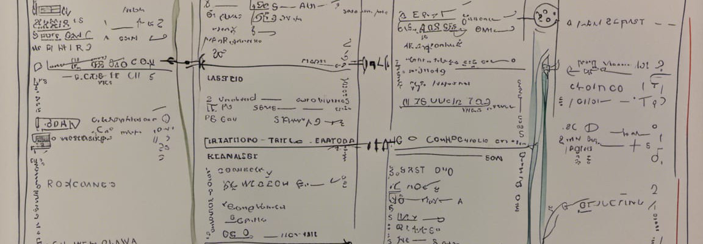

# NER с использованием ChatGPT



Подкинул мне как-то коллега-товарищ идею делать NER (named entities recognition), используя chat gpt. Идея показалась мне интересной, я вооружился семплами текста, gpt-3.5-turbo и провел небольшой эксперимент, о чем сейчас вам и расскажу.

## Постановка задачи эксперимента
Сделать распознавание адресов, имен организаций, номеров телефонов, товаров в тексте и представить их в формате понятном для компьютера. Под "понятный для компьютера" так-же имеется в виду, что нам не нужен человек, который будет валидировать ответы GPT сети.

Адреса нам интересно разобрать на следующие компоненты: страна, регион, район, улица, номер дома.

Для товаров мы будем искать: название, цену, категорию и примечания.

Имена организаций и номера телефонов будем просто собирать как есть.

В качестве компьютеропонятного формата возьмем JSON. Не, ну а что вы еще ожидали от жаваскрипт-писателя со стажем?

Обращу внимание, что для каждого запроса на разбор я создаю новый контекст, чтобы предыдущий не влиял на ответ.

## Пробуем распознать имена организаций

С футера сайта своей Альма-матер я взял контактную информацию. Контактная информация в футере уже не плохо структурирована, но явной разметки не имеет. Над этим семплом текста я и буду экспериментировать.

```
ул. Чехова, 2, ауд. И-201
г. Таганрог, 347922, Ростовская область, Россия

Телефон: 8 (8634) 360-450

E-Mail: info@ictis.sfedu.ru

Ответственный за сайт: --- ---
Сайт разработан Студенческим конструкторским бюро
"Компьютерное инновационное творчество" ИКТИБ

© 2015-2023, Институт компьютерных технологий и информационной безопасности ИТА ЮФУ
```

Для начала я попробовал сформулировать запрос на распознавание, не предъявляя требований к конкретной структуре json-а.

```
Распознай имена организаций и дай ответ в формате json

<sample_text>
```

GPT сеть пошуршала матрицами и выдала мне следующий ответ:

```json
{
  "организации": [
    "Институт компьютерных технологий и информационной безопасности ИТА ЮФУ",
    "Студенческое конструкторское бюро 'Компьютерное инновационное творчество' ИКТИБ"
  ]
}
```

Как видно, нейронка не плохо справилась с распознаванием, но кириллические ключи - не прикольно. Я усовершенствовал свой запрос, добавив в него конкретики о том, какую структуру я хочу получить.

```
Распознай имена организаций и дай ответ в формате json {"organizations":["organization name"]}

<sample_text>
```

Вот! Теперь ключ в нужном формате, но настигла другая беда - json не валидный. Я пробовал разные варианты запросов, но мне так и не удалось заставить нейронную сеть дать мне валидный json с первого промта в новом контексте.

```json
{
  "organizations": [
    "Институт компьютерных технологий и информационной безопасности ИТА ЮФУ",
    "Студенческое конструкторское бюро "Компьютерное инновационное творчество" ИКТИБ"
  ]
}
```

Интереса ради, в том же контексте я попросил его исправить json и что вы думаете?! Таки исправил! Но я считаю, что это не удовлетворительно, потому что это может выстрелить в любой момент. Можно, конечно, пробовать как-то автоматически исправлять json или использовать другой формат, но затея выглядит сомнительной.

Просил его исправить, дав ему на вход следующий запрос:

```
Сейчас строки в массиве имеют неверный формат. Исправь их
```

Ответ, который я получил от нейронки.
```json
{
  "organizations": [
    "Институт компьютерных технологий и информационной безопасности ИТА ЮФУ",
    "Студенческое конструкторское бюро \"Компьютерное инновационное творчество\" ИКТИБ"
  ]
}
```

## Номера телефонов

Имея накопленный опыт, я попросил распознать номера телефонов в тексте. Промт я сформировал такой:

```
Распознай в тексте номера телефонов. Ответ дай в формате ["phone number"]

<sample_text>
```

После непродолжительного шуршания я получил ответ:

```json
["8 (8634) 360-450"]
```

PROFIT!

Как бы да, но нет. В процессе написания этой статьи во всех моих запросах мне удавалось распознать номера телефонов с разной степенью успешности, но ранее мне удавалось воспроизвести ситуацию, когда GPT отказывался распознавать номера, ссылаясь на то, что не хочет распознавать персональные данные и все такое.

## Адреса

Адрес - достаточно сложная структура. Изначально, я не питал сильных надежд на тему распознавания адреса в тексте, поэтому для начала я попробовал бросить все "на самотек", то есть дать GPT самой определиться со структурой.

```
Найди в тексте географические адреса и разбей их на отдельные компоненты. Ответ дай в формате json

<sample_text>
```

Ответ оказался несколько избыточным, но адрес распознался великолепно. JSON не валидный - потрачено.

```json
{
  "address": {
    "street": "ул. Чехова",
    "house_number": "2",
    "room": "ауд. И-201",
    "city": "Таганрог",
    "postal_code": "347922",
    "region": "Ростовская область",
    "country": "Россия"
  },
  "phone": "8 (8634) 360-450",
  "email": "info@ictis.sfedu.ru",
  "website_responsible": "--- ---",
  "website_developed_by": "Студенческое конструкторское бюро "Компьютерное инновационное творчество" ИКТИБ",
  "copyright": "© 2015-2023, Институт компьютерных технологий и информационной безопасности ИТА ЮФУ"
}
```

Конкретизировав свои хотелки, я задал желаемую структуру.

```
Найди в тексте географические адреса и разбей их на отдельные компоненты. Ответ дай в формате {"address":{"street":"street name","house_number":"house number","room":"room","city":"city name","postal_code":"postal code","region":"region name","country":"country name"}}

<sample_text>
```

Теперь осталось только нужное!

```json
{
  "address": {
    "street": "ул. Чехова",
    "house_number": "2",
    "room": "ауд. И-201",
    "city": "Таганрог",
    "postal_code": "347922",
    "region": "Ростовская область",
    "country": "Россия"
  }
}
```

Стоит отметить, что иногда GPT выдает несуразный мапинг для адресов. Так что придется делать какой-то санитайзер, чтобы отбрасывать лишнее.

## Товары

На мой взгляд - это самый интересный кейс. Чеки, акты и прочие документы, где может встречаться перечисление каких-то товаров или услуг с их параметрами.

Для проверки этого кейса я взял другой семпл текста. Данный семпл есть описание товара на одной из музыкальных барахолок.

```
Нижний Новгород / Пересыл

Возможно на хайгейновые педальки. Предлагайте вообщем, какую именно еще не определился.

Zephyr fx / 11к / Родная коробка
Родился пару месяцев назад. Понял ,определился. Нужны другие оверы.

Akai E2 Headrush Delay/Looper | 7к
Есть косметические дефекты по функционалу все ок.Улучшена кнопка переключения эффектов.
Липучка на дне

Vox 847 | 3k
Состояние хорошее. Но продавец с авито оказался подлецом. Давно это было. Я сразу не обратил внимание на такой нюанс как ход потца. Ощущение хода не очень,происходит провал в движении и только потом небольшое сапротивление. Да и кажется что эффект не до конца докручивается. Вариант для тех у кого есть свободный потенциометр.
```

Так же пробую дать волю нейронке и прошу дать ответ в свободной форме.

```
Определи товары в тексте. Цену напиши в рублях. Ответ дай в формате json

<sample_text>
```

Ответ выглядит хорошо. Описание товаров она посчитала ненужным, цену дала в рублях как я и заказывал.

```json
{
  "товары": [
    {
      "название": "Zephyr fx",
      "цена": "11000 руб."
    },
    {
      "название": "Akai E2 Headrush Delay/Looper",
      "цена": "7000 руб."
    },
    {
      "название": "Vox 847",
      "цена": "3000 руб."
    }
  ]
}
```

Пробую вариант с конкретной структурой.

```
Определи товары в тексте. Цену напиши в рублях. Ответ дай в формате {"products":[{ "name":"product name", "price":"price", "description": "product description", "type": "product type" }]}

<sample_text>
```

Прэтти гуд! В поле type, в целом, попали правильные типы, но пользы от них не много. Я пробовал дополнительным промтом конкретизировать тип эффектов, но более качественным ответ не стал. Ах, да в поле price пропало название валюты. Последнее не сильно критично, но снова нужна постобработка.

```json
{
  "products": [
    {
      "name": "Zephyr fx",
      "price": "11000",
      "description": "Родная коробка. Родился пару месяцев назад. Понял, определился. Нужны другие оверы.",
      "type": "хайгейновые педальки"
    },
    {
      "name": "Akai E2 Headrush Delay/Looper",
      "price": "7000",
      "description": "Есть косметические дефекты, по функционалу все ок. Улучшена кнопка переключения эффектов. Липучка на дне.",
      "type": "эффекты"
    },
    {
      "name": "Vox 847",
      "price": "3000",
      "description": "Состояние хорошее. Ощущение хода не очень, происходит провал в движении и только потом небольшое сопротивление. Да и кажется, что эффект не до конца докручивается. Вариант для тех, у кого есть свободный потенциометр.",
      "type": "эффекты"
    }
  ]
}
```

## Группировка запросов
Я так же пробовал комбинировать распознавание разных сущностей в одном запросе. GPT вполне справлялась с этой задачей, на том десятке текстов, на котором я тестировал NER.

## Вывод
Оно работает! GPT справляется с распознаванием сущностей в тексте, но не без минусов, главный из которых - никакой гарантии валидности запрошенной структуры. Так же, по мнению из интернетов, это будет стоить дорого, но тут я ничего не подсчитывал и умного ничего не скажу.
