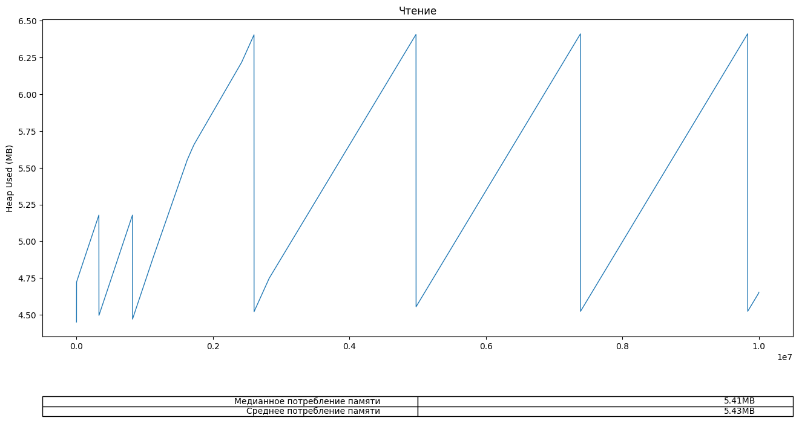
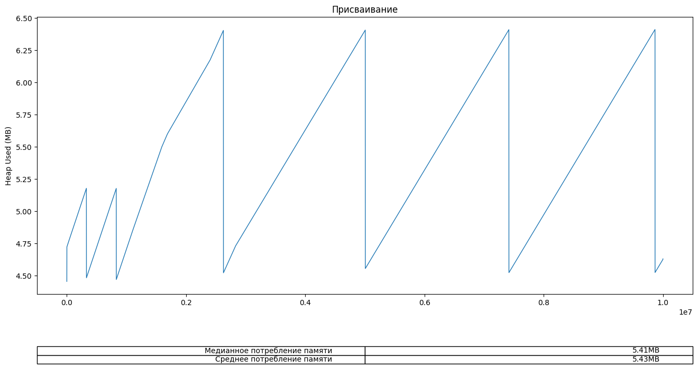
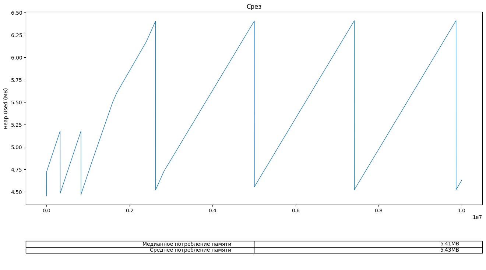
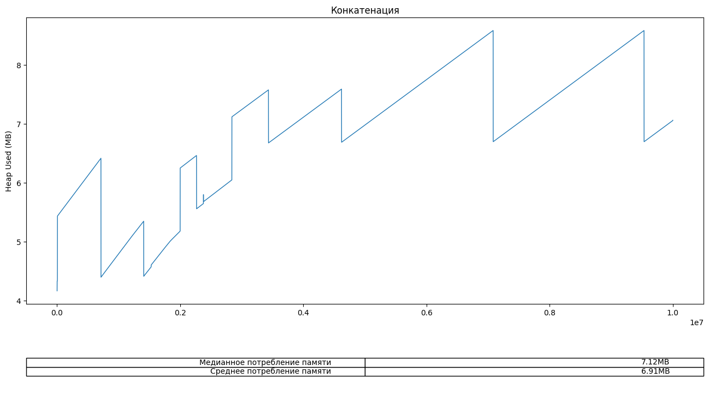

# V8. Строки и память

Многим известно, что в JavaScript типы данных делятся на примитивы и объекты. Вот что говорит MDN на тему примитивов:

> Примитив (значение примитивного типа, примитивный тип данных) это данные, которые не являются объектом и не имеют методов. В JavaScript 7 простых типов данных: string, number, boolean, null, undefined, symbol (новое в ECMAScript 2015), bigint.

Если продолжить читать дальше, то можно увидеть следующее:

> Все примитивы неизменяемы (immutable), то есть они не могут быть изменены. Важно не путать сам примитив с переменной, которой присвоено значение примитивного типа. Переменной может быть переприсвоено новое значение, но существующее значение примитивного типа не может быть изменено подобно объектам, массивам и функциям.

С неизменяемостью чисел, булевых значений и юнит типов все ясно, но вот строки... Если чутка погрузиться в суть, то строки вовсе не примитивы, а вполне себе объекты, которые состоят из какого-то массива и длины. Что происходи с строками при передаче их в функцию или при конкатенации (склеивании) строк? Сейчас разберемся.

# Навука!
Первое, что пришло мне в голову - это провести эксперимент. Я составил три семпла кода, которые используя длинную строку реализовывали четыре разаных сценария: чтение строки, запись строки в переменную, конкатенация (склеинвание) строки и слайс (срез) строки.

## Дизайн эксперимента
[runner.js](tests/runner.js)

## Чтение строки
[no_mutations.js](tests/no_mutations.js)

## Запись строки в переменную
[assign.js](tests/assign.js)

## Слайс (срез)
[slice.js](tests/slice.js)

## Конкатенация (склеивание)
[with_mutations.js](tests/with_mutations.js)

